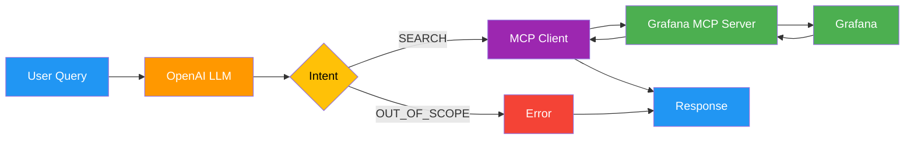

# Grafana Dashboard Agent

A simple LangGraph agent that lets you query Grafana dashboards using natural language.

## Features

- **List dashboards**: "Show me all dashboards"
- **Search by name**: "Find dashboards with prod in the name"
- **Semantic search**: "Do we have dashboards for system health?" (expands to node|system|health|cpu|memory)

## Prerequisites

- Python 3.11+
- Docker and Docker Compose
- OpenAI API key

## Setup

### 1. Set up the Metrics Observability Pipeline

The Grafana instance and MCP server come from the [metrics-observability-pipeline](https://github.com/guptaachin/metrics-observability-pipeline) repo.

```bash
# Clone the pipeline repo
git clone https://github.com/guptaachin/metrics-observability-pipeline.git
cd metrics-observability-pipeline

# Start the pipeline (Grafana, Victoria Metrics, MCP server, etc.)
./start-mop

# Or on Windows:
docker-compose -f ./docker-compose-mop.yaml up -d --force-recreate --build --remove-orphans
```

Verify the containers are running:
```bash
docker ps | grep mop
```

You should see containers including `mop-grafana` and `mop-grafana-mcp`.

**Grafana credentials:**
- URL: http://localhost:3000
- Username: `mopadmin`
- Password: `moppassword`

### 2. Install this agent

```bash
# Clone this repo (if not already)
cd /path/to/observability-agent

# Create and activate virtual environment
python -m venv venv
source venv/bin/activate  # On Windows: venv\Scripts\activate

# Install dependencies
pip install -r requirements.txt
```

### 3. Configure environment variables

```bash
cp .env.example .env
# Edit .env with your settings
```

Required variables:
```
OPENAI_API_KEY=sk-...
MCP_SERVER_URL=http://localhost:8001  # optional, this is the default
OPENAI_MODEL=gpt-4-turbo              # optional, this is the default
```

## Running

Start the Gradio chat interface:
```bash
python -m src.main
```

Then open http://localhost:7860 in your browser.

## Example Queries

| Query | What it does |
|-------|--------------|
| "Show me all dashboards" | Lists all dashboards |
| "What dashboards are available?" | Lists all dashboards |
| "Find dashboards with metrics" | Searches for "metrics" |
| "Is there a dashboard named node?" | Searches for "node" |
| "Dashboards for system health" | Searches node\|system\|health\|cpu\|memory |
| "API monitoring dashboards" | Searches api\|service\|http |

## Architecture

```
src/
├── config.py      # Configuration (env vars) and LLM setup
├── mcp_client.py  # MCP client using SSE transport
├── agent.py       # Single-node LangGraph agent
└── main.py        # Gradio chat UI
```

### Data Flow



**Flow:**
1. User enters natural language query in Gradio chat
2. LLM extracts search intent (keywords or out-of-scope)
3. MCP client queries Grafana via SSE transport
4. Results are formatted and returned to user

The agent uses an LLM to extract search intent from natural language, then queries Grafana via the MCP server.

## Out of Scope

The agent cannot:
- Query or visualize metrics
- Analyze data or detect anomalies
- Modify dashboards
- Remember previous conversations

## Related

- [metrics-observability-pipeline](https://github.com/guptaachin/metrics-observability-pipeline) - Grafana + Victoria Metrics + MCP server setup
- [mcp-grafana](https://github.com/grafana/mcp-grafana) - Grafana MCP server

## License

MIT
