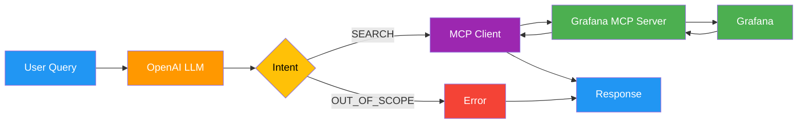

# Week 1: Simple Grafana Dashboard Agent

**Goal**: Build a single-node LangGraph agent that interacts with Grafana via MCP to answer basic dashboard queries.

---

## What Was Built

A conversational agent that lets engineers query Grafana dashboards using natural language:

- **List dashboards**: "Show me all dashboards"
- **Search by name**: "Find dashboards with prod in the name"  
- **Semantic search**: "Do we have dashboards for system health?"

### Architecture



### Files Created

| File | Purpose | Lines |
|------|---------|-------|
| `src/config.py` | Configuration and LLM setup | ~40 |
| `src/mcp_client.py` | MCP client using SSE transport | ~100 |
| `src/agent.py` | Single-node LangGraph agent | ~150 |
| `src/main.py` | Gradio chat UI | ~35 |

**Total**: ~325 lines of code

---

## Key Decisions

| Decision | Rationale |
|----------|-----------|
| **SSE transport** for MCP | MCP server already running in Docker at port 8001 |
| **LLM-based intent extraction** | More flexible than keyword matching for natural language |
| **Multi-keyword search** | "system health" → searches `node\|system\|health\|cpu` for semantic matching |
| **Single-node agent** | Simplest LangGraph pattern for learning; no complex orchestration |
| **Gradio UI** | Quick to set up, good for demos |

---

## Demo

### Example Queries

| Query | What Happens |
|-------|--------------|
| "Show me all dashboards" | Lists all dashboards |
| "Find dashboards with metrics" | Searches for "metrics" |
| "Dashboards for system health" | Searches `node\|system\|health\|cpu\|memory` |
| "Analyze my CPU usage" | Returns "I can only list or search dashboards" |

### Running It

```bash
# Terminal 1: Start the observability pipeline (Grafana + MCP)
git clone https://github.com/guptaachin/metrics-observability-pipeline.git
cd metrics-observability-pipeline
./start-mop

# Terminal 2: Start the agent
cd observability-agent
source venv/bin/activate
python -m src.main
```

Open http://localhost:7860

---

## Future Scope

- Metrics querying or visualization
- Anomaly detection or analysis
- Dashboard modification
- Multi-turn conversation memory
- Ollama support (OpenAI only)

---

## Review Learnings

1. **MCP Protocol**: How to connect to MCP servers using SSE transport
2. **LangGraph Basics**: Single-node StateGraph with dict-based state
3. **LLM Intent Extraction**: Using structured prompts instead of if-else logic
4. **Semantic Search**: Expanding user intent into multiple search keywords

---
