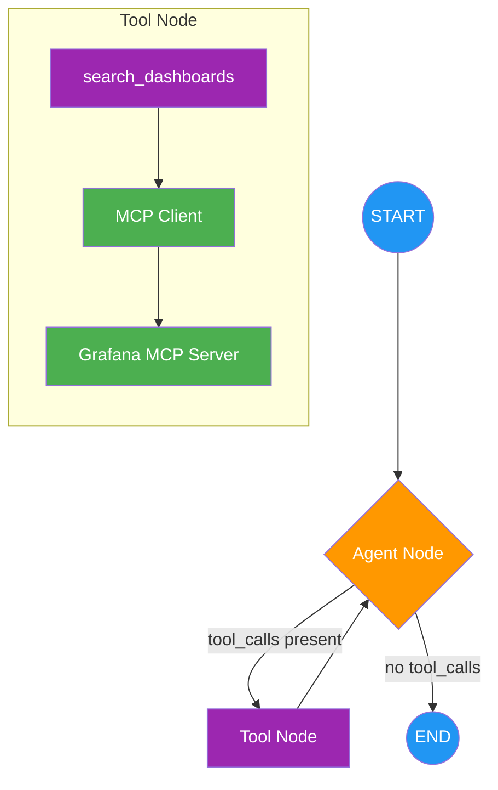

# Week 2: Adding mcp client as Tool

**Goal**: Refactor from a single-node agent to a multi-node tool-calling agent where the LLM decides when to invoke tools.

---

## What Changed

Separated the MCP call into a **tool** that the agent calls via LangGraph's tool-calling pattern. The LLM now reasons about _when_ to search dashboards instead of following a rigid `SEARCH:` / `OUT_OF_SCOPE:` format.

### Architecture



### Week 1 (single node) vs Week 2 (tool-calling)

| | Week 1 | Week 2 |
|---|--------|--------|
| **Graph** | `START → agent → END` | `START → agent ⇄ tools → END` |
| **LLM role** | Extract `SEARCH:` keyword | Decide to call `search_dashboards` tool |
| **MCP call** | Inside agent node | Separate tool node |
| **Routing** | None | Conditional edge based on `tool_calls` |
| **State** | `dict` with `query`/`response` | `AgentState(TypedDict)` with `messages` |

### Key Components

| Component | Purpose |
|-----------|---------|
| `AgentState` | TypedDict with `messages` using `add_messages` reducer |
| `agent_node` | Invokes LLM with tools bound; decides next action |
| `tool_node` | Executes `search_dashboards` tool, returns `ToolMessage` |
| `should_continue` | Routes to `tools` if LLM made tool calls, else `END` |
| `search_dashboards` | `@tool` wrapping MCP client for dashboard search |

---

## Running

```bash
# Gradio UI
python -m src.main

# LangGraph Studio (visualize graph)
langgraph dev
```

---

## Key Learnings

1. **Tool-calling pattern**: LLM decides when to use tools via `bind_tools()` + `tool_calls`
2. **Conditional edges**: `should_continue` routes between tool execution and termination
3. **Message-based state**: `AgentState` with `add_messages` reducer handles message accumulation
4. **Agent loop**: The `agent → tools → agent` cycle allows multi-step reasoning
5. **LangGraph CLI**: `langgraph.json` config with module path (`src.agent:build_agent`) for Studio

---